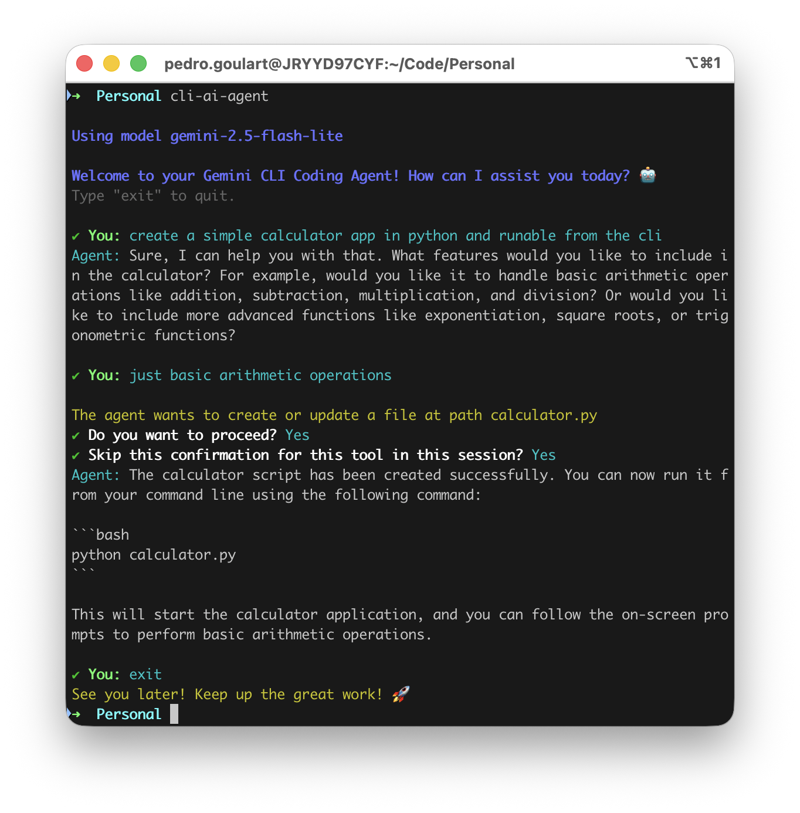
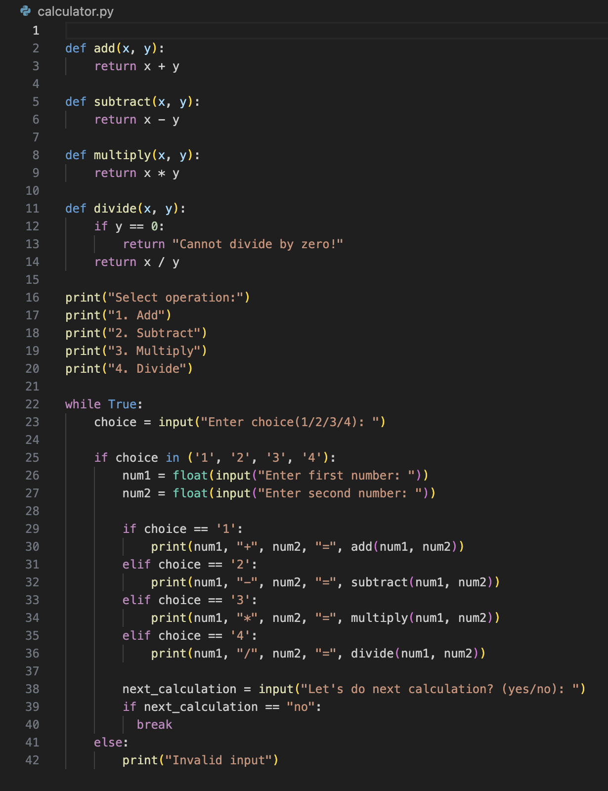

# cli-ai-agent

A command line interface (CLI) operated AI agent using Gemini as the primary LLM. This tool allows users to interact with Gemini and, among other things, ask it to generate code, search local files, and run commands on your behalf.

# Getting started

### Installing dependencies

This app uses npm as the package management tool. To install dependencies, run the following command:

```
npm install
```

### Set up Gemini API Key (`GEMINI_API_KEY`)

In order to run this app you will need to have a valid Gemini API Key. View https://ai.google.dev/gemini-api/docs/api-key to setup a key. Please ensure your billing details are configured correctly. View more information in https://ai.google.dev/gemini-api/docs/billing.

### Set up environment variables

You will need to setup the environment variables before running the app. Run the following command to copy the example env file and then update the `GEMINI_API_KEY` variable.

```
cp config/.env.example config/.env
# then open config/.env and update the values
```

### Grant permissions

You will need to grant execute permission to the main executable in this repo `index.js`:

```
chmod +x index.js
```

### All done!

You should now be able to initialize the CLI AI Agent with the following command:

```
cli-ai-agent
```

# Settings

### Updating the Gemini model

The app is setup by default to use the 'gemini-2.0-flash-lite' model. You can customize this by updating the `GEMINI_MODEL` env variable. View https://ai.google.dev/gemini-api/docs/models for more information on available models.

# Tools

This app passes tool definitions to the model, which are similar to skill definitions. Tools are defined in the `data/tools.js` file. This is an overview of the available tools on this app.

### writeFile

This allows the agent to create or update a file within the current working directory. You cannot write or update files within system folders. It is important to note that this limitation was put in place to mitigate potential risky file updates.

# Example usage

Call the CLI agent by running `cli-ai-agent` on the terminal. Type in your query, such as "Create a simple calculator app." 



The resulting code from this command is added below. It was saved to `./calculator.py` on this example.


